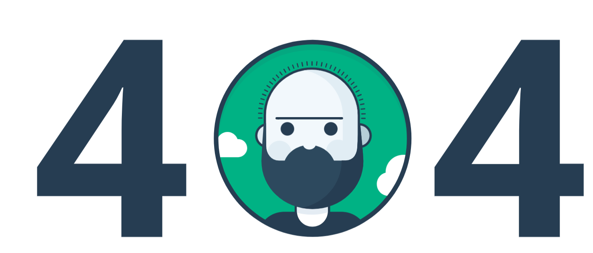

<h3 align="center">vue-pnf</h3>

<div align="center">

[]()
[](https://github.com/kylelobo/The-Documentation-Compendium/issues)
[](https://github.com/kylelobo/The-Documentation-Compendium/pulls)
[](/LICENSE)

</div>

---

<p align="center">  
A Vue library consisting of one or more component for showing Page Not Found / 404.
    <br>
</p>



## 📝 Table of Contents


- [📝 Table of Contents](#-table-of-contents)
- [🧐 About <a name = "about"></a>](#-about-)
- [🏁 Components <a name = "components"></a>](#-components-)
- [🎈Prerequisites](#prerequisites)
- [🎈Installing](#installing)
- [🎈 Usage <a name="usage"></a>](#-usage-)
- [⛏️ Built Using <a name = "built_using"></a>](#️-built-using-)
- [✍️ Authors <a name = "authors"></a>](#️-authors-)
 

## 🧐 About <a name = "about"></a>

A set of components for showing error page or 404 in Vuejs project.

## 🏁 Components <a name = "components"></a>

This library includes following components

- **Animated**, an animate 404 Page with CSS animation

## 🎈Prerequisites

- Nodejs
- Vuejs

## 🎈Installing

You can install the package from NPM registry or from github packages registry

```bash
npm i --save @codehat/vue-pnf
```

## 🎈 Usage <a name="usage"></a>

Here is simple usage

```javascript
<template>
  <div class="home">
    <v-404/>     
  </div>
</template>
<script>
```

```javascript
import { Animated } from "@codehat/vue-pnf";
export default {  
  components: {
 "v-404": Animated,    
  },
};
</script>

```
 

## ⛏️ Built Using <a name = "built_using"></a>

- [VueJs](https://vuejs.org/) - Web Framework
- [NodeJs](https://nodejs.org/en/) - Server Environment

## ✍️ Authors <a name = "authors"></a>

- [@manojap](https://github.com/manojap) - Idea & Initial work
 